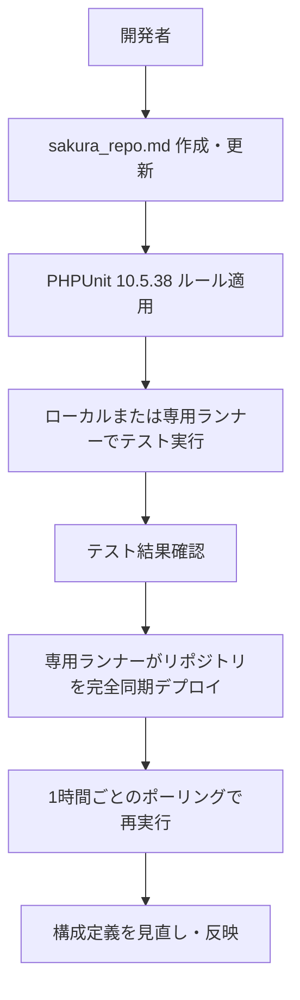

# sakura_repo.md — レンタルサーバー専用リポジトリ構成定義

## 概要
- レンタルサーバー環境で単一アプリを運用するための構成定義レイヤー。
- リポジトリルートはサーバー上のユーザープロファイルパス（例: `/home/<username>/`）と一致し、モノレポ構成とは独立して扱う。
- CI は GitHub Actions ではなく、専用ランナーがリポジトリ全体をクローンしてミラーリングする前提。

## リポジトリ前提
- 配置パス: `/home/<username>/` 直下にリポジトリを配置する。
- 単一アプリ構成を前提とし、外部リポジトリへのシンボリックリンクやサブモジュール依存は行わない。
- composer による依存管理を行い、PHP プロジェクト運用に限定する。

## 運用ポリシー
- テストは PHPUnit を使用し、バージョンを 10.5.38 に固定する。
- 専用ランナーが 1 時間ごとにポーリングし、GitHub 上の当該リポジトリをクローンしてレンタルサーバー上に完全同期（ミラーリング）する。
  - 差分コピーではなく全体同期を原則とする。
  - デプロイおよび SSH 転送ログはランナー側で保存し、サーバーには Secrets を残さない。
- ブランチ運用は単一アプリ向けの簡潔さを優先し、モノレポと異なる開発・検証サイクルを維持する。

## CI・テスト実行
ローカルまたは専用ランナー上で以下を実行する。

```bash
$ vendor/bin/phpunit --configuration phpunit.xml
# 使用バージョン: phpunit/phpunit 10.5.38
```

## デプロイ/ポーリング手順
1. 専用ランナーが 1 時間ごとにリポジトリをクローン。
2. 最新コミットで PHPUnit 10.5.38 を実行し、失敗した場合はデプロイを中断。
3. 成功時にリポジトリ全体を `/home/<username>/` 直下へミラーリングして反映。
4. 同期後のログをサーバー側に保管し、次回ポーリングで再評価する。

## 拡張方針
- 将来的にモノレポ定義と統合する場合でも、本ドキュメントの内容を構成層として吸収できるよう章立てを維持する。
- CI/デプロイの追加要件が発生した際は、専用ランナー前提を崩さずに拡張する。

## 品質ゲート
- PHPUnit 10.5.38 が成功すること。
- デプロイはミラーリング（完全同期）で行われ、Secrets をサーバー上に残さないこと。
- Markdown 構文エラーがないこと。

## 参照ポリシー
- 本ドキュメントはレンタルサーバー向けに単独完結させ、他の構成定義ファイルへの参照を前提としない。

## フロー可視化

