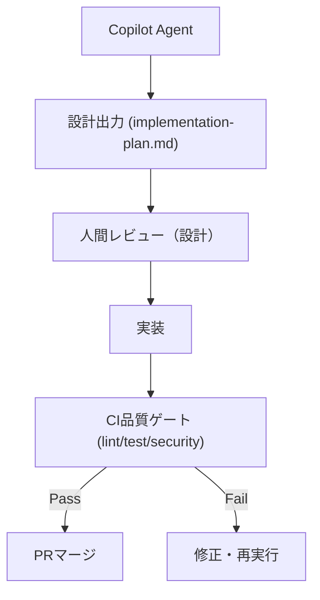

# 20 Architecture — 二層構造と開発ループ

## 二層構造
- **規範層**: `.github/copilot-instructions.md` — 短く強いルール。全タスク共通。
- **仕様層 (SSOT)**: `.github/copilot/*.md` — 要件・設計・品質・セキュリティの単一情報源。
- **実行指示レイヤ**: `.github/instructions/**/*.instructions.md` — `applyTo` で対象ファイルに適用される補助的な設計/背景資料レイヤ。

## 開発フロー（2段階ループ）

- Phase A (Design): `80-templates/implementation-plan.md` に沿って plan を作り、レビューで固定する。
- Phase B (Implement): 確定 plan の範囲で実装し、CI 品質ゲートを全て通過させる。

## 責務分担
- 仕様の更新・判断根拠: `.github/copilot/` と `70-adr/`
- 実務上の禁止事項・コマンド: `.github/instructions/`（パス適用）
- 実装・テスト計画: `80-templates/implementation-plan.md`

## 依存と適用範囲
- すべてのタスクは `00-index.md` の参照順を守る。
- 破壊的変更や例外的運用は必ず ADR または plan に残す。

## Issue 運用ルール
- Copilot を Issue にアサインする前に、必要な要件は本文へすべて記載する（アサイン後のコメントは認識されないため、追記は PR コメントで渡す）。
- 設計と実装の Issue は分離し、設計 Issue はドキュメントのみの PR、実装 Issue は確定 plan のパスを明示してその範囲に限定する。
- 不確実性解消のために **[RESEARCH]** Issue を設け、コード変更禁止を基本とする（成果物は docs/research や Issue/PR コメントに集約し、結論は ADR/Requirements へ昇格させてから Design に渡す）。
- 仕様参照を避けたい場合は、任意フェーズの Issue に付与できるモディファイアとして **[BLIND]** を用いる。本文に必要情報を埋め込み、参照禁止範囲と変更可否を明示する。成果物は最小差分かつ本文完結とする。
- 推奨する最小セット: `[RESEARCH]`（調査のみ）、`[DESIGN]`（plan確定）、`[IMPLEMENT]`（plan通り実装）、`[BLIND]`（任意フェーズに付与可能な仕様参照抑制モディファイア）。
