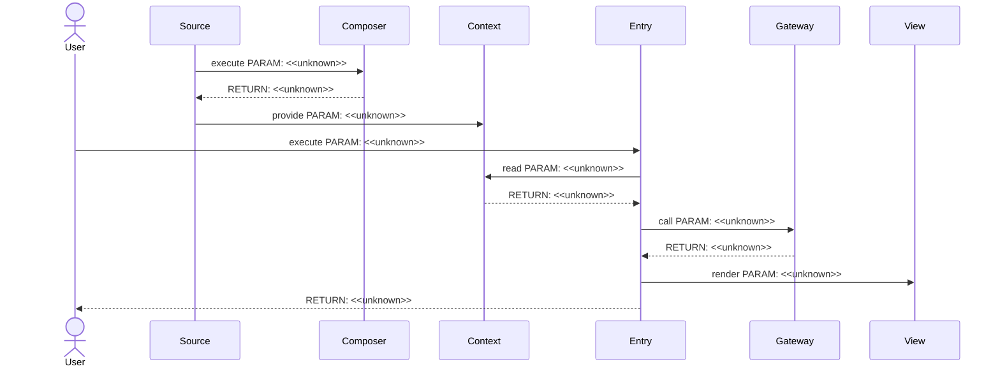
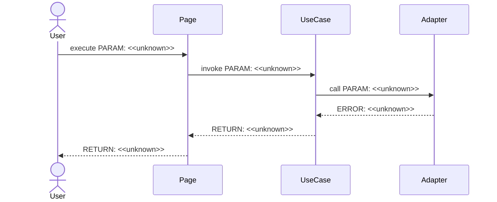
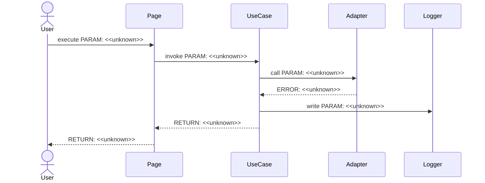
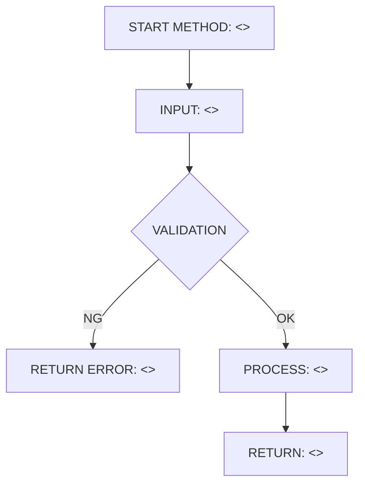
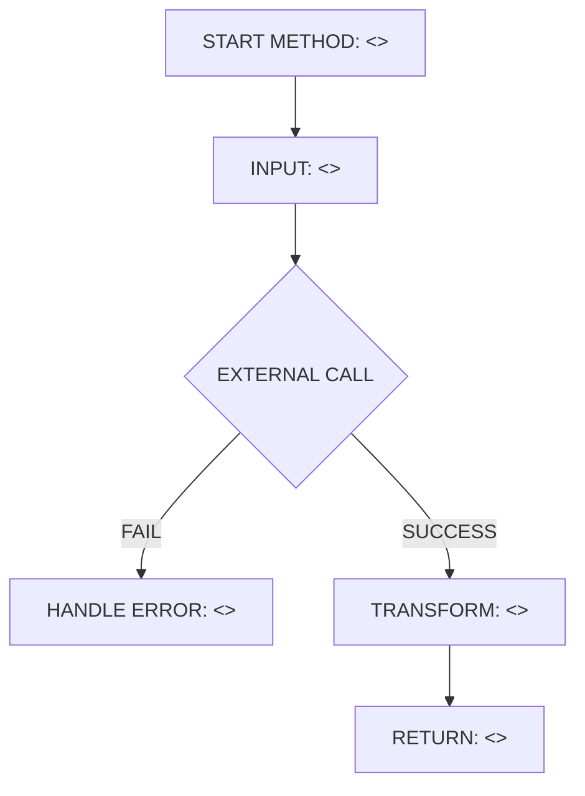
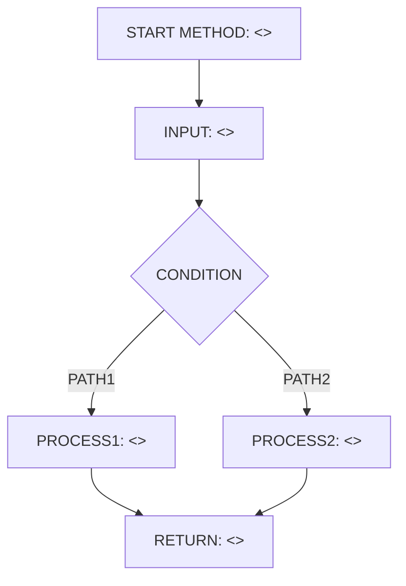

# Implementation Plan テンプレート

---

## 0. 実装入力コンテキスト

| 項目 | 記入 |
| --- | --- |
| 対象Issue | <<unknown>> |
| 対象リポジトリ内パス（実装起点） | <<unknown>> |

運用補足: Agentが実装時に直接参照する入力のみを記載する。未確定は `TBD（理由/決定条件/期限）` で記載する。

### 0.1 変更サマリ一覧（複数行）

| 区分（追加/修正/削除） | 対象（機能/画面/API） | 変更概要 |
| --- | --- | --- |
| 追加 | <<unknown>> | <<unknown>> |
| 追加 | <<unknown>> | <<unknown>> |
| 追加 | <<unknown>> | <<unknown>> |
| 追加 | <<unknown>> | <<unknown>> |
| 追加 | <<unknown>> | <<unknown>> |
| 追加 | <<unknown>> | <<unknown>> |
| 追加 | <<unknown>> | <<unknown>> |
| 修正 | <<unknown>> | <<unknown>> |
| 修正 | <<unknown>> | <<unknown>> |
| 修正 | <<unknown>> | <<unknown>> |
| 修正 | <<unknown>> | <<unknown>> |
| 修正 | <<unknown>> | <<unknown>> |
| 修正 | <<unknown>> | <<unknown>> |
| 削除 | <<unknown>> | <<unknown>> |
| 削除 | <<unknown>> | <<unknown>> |
| 削除 | <<unknown>> | <<unknown>> |
| 削除 | <<unknown>> | <<unknown>> |
| 削除 | <<unknown>> | <<unknown>> |
| 削除 | <<unknown>> | <<unknown>> |

運用補足: 行数が不足する場合は同じ形式で行を追加する。

### 0.2 入力制約一覧（複数行）

| 制約区分（互換性/禁止事項/期限/その他） | 制約内容 | 適用対象 |
| --- | --- | --- |
| 互換性 | <<unknown>> | <<unknown>> |
| 互換性 | <<unknown>> | <<unknown>> |
| 互換性 | <<unknown>> | <<unknown>> |
| 互換性 | <<unknown>> | <<unknown>> |
| 互換性 | <<unknown>> | <<unknown>> |
| 禁止事項 | <<unknown>> | <<unknown>> |
| 禁止事項 | <<unknown>> | <<unknown>> |
| 禁止事項 | <<unknown>> | <<unknown>> |
| 禁止事項 | <<unknown>> | <<unknown>> |
| 禁止事項 | <<unknown>> | <<unknown>> |
| 期限 | <<unknown>> | <<unknown>> |
| 期限 | <<unknown>> | <<unknown>> |
| 期限 | <<unknown>> | <<unknown>> |
| 期限 | <<unknown>> | <<unknown>> |
| 期限 | <<unknown>> | <<unknown>> |
| その他 | <<unknown>> | <<unknown>> |
| その他 | <<unknown>> | <<unknown>> |

運用補足: 行数が不足する場合は同じ形式で行を追加する。

### 0.3 関連機能・関連仕様一覧（複数行）

| 種別（要件/設計方針/ADR/調査/既存実装/外部仕様/その他） | パス/識別子 | この設計での利用目的 |
| --- | --- | --- |
| 要件 | <<unknown>> | <<unknown>> |
| 要件 | <<unknown>> | <<unknown>> |
| 要件 | <<unknown>> | <<unknown>> |
| 要件 | <<unknown>> | <<unknown>> |
| 設計方針 | <<unknown>> | <<unknown>> |
| 設計方針 | <<unknown>> | <<unknown>> |
| 設計方針 | <<unknown>> | <<unknown>> |
| ADR | <<unknown>> | <<unknown>> |
| ADR | <<unknown>> | <<unknown>> |
| ADR | <<unknown>> | <<unknown>> |
| 調査 | <<unknown>> | <<unknown>> |
| 調査 | <<unknown>> | <<unknown>> |
| 既存実装 | <<unknown>> | <<unknown>> |
| 既存実装 | <<unknown>> | <<unknown>> |
| 外部仕様 | <<unknown>> | <<unknown>> |
| 外部仕様 | <<unknown>> | <<unknown>> |
| その他 | <<unknown>> | <<unknown>> |
| その他 | <<unknown>> | <<unknown>> |

運用補足: 行数が不足する場合は同じ形式で行を追加する。

---

## 1. 実装対象機能と機能ゴール

| 項目 | 内容 | 根拠 |
| --- | --- | --- |
| 実装対象詳細（機能/画面/API） | <<unknown>> | <<unknown>> |
| 機能ゴール（実装後に観測できるユーザーユース） | <<unknown>> | <<unknown>> |
| 非ゴール（今回やらないこと） | <<unknown>> | <<unknown>> |
| 完了条件（実装完了の判定） | <<unknown>> | <<unknown>> |
| 受入確認手順（1行で再現可能） | <<unknown>> | <<unknown>> |

運用補足: 「完了条件」はテストまたは確認手順で判定可能な文で記載する。
運用補足: 「受入確認手順」はコマンド/操作を1行で再現できる形で記載する（例: `/dashboard` 表示確認 + lint 実行）。

---

## 2. 前提・制約（SSOT）

| 種別 | 内容 | 根拠（ファイル/ADR/Issue） |
| --- | --- | --- |
| 参照したSSOT | <<unknown>> | <<unknown>> |
| Next.js構成前提（app/src/packages） | <<unknown>> | <<unknown>> |
| 依存境界前提（page.tsx / AppProvider / contracts） | <<unknown>> | <<unknown>> |
| 技術制約（互換性/期限/運用/セキュリティ） | <<unknown>> | <<unknown>> |
| 未確定前提（TBD） | TBD（理由/決定条件/期限） | <<unknown>> |

運用補足: 根拠は `ファイルパス` または `Issue/ADR` を必ず記載する。

---

## 3. 要件定義（実装受入条件）

### 3.1 機能要件

| ID | 要件 | 受入条件（テスト可能な形） |
| --- | --- | --- |
| FR-01 | <<unknown>> | <<unknown>> |
| FR-02 | <<unknown>> | <<unknown>> |
| FR-03 | <<unknown>> | <<unknown>> |
| FR-04 | <<unknown>> | <<unknown>> |
| FR-05 | <<unknown>> | <<unknown>> |
| FR-06 | <<unknown>> | <<unknown>> |
| FR-07 | <<unknown>> | <<unknown>> |
| FR-08 | <<unknown>> | <<unknown>> |
| FR-09 | <<unknown>> | <<unknown>> |
| FR-10 | <<unknown>> | <<unknown>> |

運用補足: IDは `FR-01` 形式の連番（欠番禁止）。

### 3.2 非機能要件

| ID | 要件 | 受入条件（テスト可能な形） |
| --- | --- | --- |
| NFR-01 | <<unknown>> | <<unknown>> |
| NFR-02 | <<unknown>> | <<unknown>> |
| NFR-03 | <<unknown>> | <<unknown>> |
| NFR-04 | <<unknown>> | <<unknown>> |
| NFR-05 | <<unknown>> | <<unknown>> |
| NFR-06 | <<unknown>> | <<unknown>> |
| NFR-07 | <<unknown>> | <<unknown>> |

運用補足: IDは `NFR-01` 形式の連番（欠番禁止）。

---

## 4. スコープ境界

運用補足: この章は「実装時の影響範囲」を記載する。設計Agentの作業内容や設計書ファイル変更そのものは書かない。
運用補足: この章は「この設計を実装したときの想定差分」を書く。現在のDesign PR差分は書かない。

### 4.0 スコープ境界の定義（機能単位）

| 区分（In-Scope/Out-of-Scope） | 対象機能/責務 | 判定理由 |
| --- | --- | --- |
| In-Scope | <<unknown>> | <<unknown>> |
| In-Scope | <<unknown>> | <<unknown>> |
| In-Scope | <<unknown>> | <<unknown>> |
| In-Scope | <<unknown>> | <<unknown>> |
| In-Scope | <<unknown>> | <<unknown>> |
| Out-of-Scope | <<unknown>> | <<unknown>> |
| Out-of-Scope | <<unknown>> | <<unknown>> |
| Out-of-Scope | <<unknown>> | <<unknown>> |
| Out-of-Scope | <<unknown>> | <<unknown>> |
| Out-of-Scope | <<unknown>> | <<unknown>> |

運用補足: 対象機能/責務は「実装で変更される責務単位」を書く（例: 初期表示データ取得責務、エラー標準化責務、import境界強制責務）。
運用補足: 判定理由は FR/NFR への対応、または非対象理由（別Issue/条件未達）で書く。
運用補足: ファイル列挙は `8.1 変更予定ファイル一覧` に一本化する。

### 4.2 実装時の影響範囲・互換性リスク

| 影響対象 | 結論（影響あり/なし/未確定） | 影響内容 |
| --- | --- | --- |
| UI/画面 | <<unknown>> | <<unknown>> |
| API契約 | <<unknown>> | <<unknown>> |
| データ互換 | <<unknown>> | <<unknown>> |
| 外部依存 | <<unknown>> | <<unknown>> |
| CI/運用 | <<unknown>> | <<unknown>> |

運用補足: 結論は `影響あり` / `影響なし` / `未確定` のいずれかを記載する。
運用補足: 結論が `未確定` の場合は、関連セクションに `TBD（理由/決定条件/期限）` を記載する。
運用補足: 影響内容は「どの挙動/契約/運用がどう変わるか」を書く。Design PRの事実説明は書かない。

### 4.3 外部依存・Secrets の扱い

| 項目 | 内容 | リスク/対応 |
| --- | --- | --- |
| 外部依存の追加/更新 | <<unknown>> | <<unknown>> |
| Secrets 利用有無 | <<unknown>> | <<unknown>> |
| ログ/設定への機密混入対策 | <<unknown>> | <<unknown>> |

### 4.4 4章の自己検証（必須）

| チェック項目 | 合格条件 |
| --- | --- |
| Design PR差分を書いていないか | `.github/copilot/plans/*.md` や「設計ドキュメントのみ変更」を記載していない |
| 実装責務を書いているか | In-Scopeに実装責務が2件以上ある |
| 実装影響を書いているか | 4.2で `影響あり/未確定` が1件以上あり、影響内容が具体記述されている |

---

## 5. アーキテクチャ設計

### 5.0 DI生成経路（テキスト必須）

| 区分（記載例/追記No） | 生成/受け渡し主体 | 契約名（contract） | 具象名（impl/plugins） | 入力（契約/型/設定） | 出力（契約/型/設定） | 境界制約（禁止事項を含む） |
| --- | --- | --- | --- | --- | --- | --- |
| 記載例 | `AppProvider` | `AppDeps（contract）` | `createPublicDepsImpl（plugins）` | 設定/環境値 | `deps` 生成開始 | `page` から `deps` を生成しない |
| 記載例 | `createPublicDeps` 等のDIファクトリ | `DashboardDataSource（contract）` | `DashboardDataSourceImpl（plugins）` | Provider入力 | 具象実装入り `deps` | 具象はこの境界外へ露出しない |
| 記載例 | `AppContext.Provider` | `AppDeps（contract）` | `AppContextProviderImpl（plugins）` | `deps` | Context配布 | Context値を加工しない |
| 記載例 | `pages/<slug>.tsx` | `DashboardDataSource（contract）` | `PageBridgeImpl（pages）` | `useAppContext()` | UIへのprops | `contracts/ui/AppContext` 以外の具象import禁止 |
| 記載例 | `ui/pages/<Slug>Page.tsx` | `DashboardPageProps（contract）` | `DashboardPageImpl（ui）` | 画面props | 表示 | DataSource呼び出し/DI生成をしない |
| 01 | <<unknown>> | <<unknown>> | <<unknown>> | <<unknown>> | <<unknown>> | <<unknown>> |
| 02 | <<unknown>> | <<unknown>> | <<unknown>> | <<unknown>> | <<unknown>> | <<unknown>> |
| 03 | <<unknown>> | <<unknown>> | <<unknown>> | <<unknown>> | <<unknown>> | <<unknown>> |
| 04 | <<unknown>> | <<unknown>> | <<unknown>> | <<unknown>> | <<unknown>> | <<unknown>> |
| 05 | <<unknown>> | <<unknown>> | <<unknown>> | <<unknown>> | <<unknown>> | <<unknown>> |

運用補足: 本表は必須。シーケンス図より先に確定し、`5.7` の図と差分がないことを確認する。
運用補足: 上5行の記載例は参照用として残し、必要に応じて追記行を記載する。
運用補足: 追記行は `01` から採番し、欠番を作らない。
運用補足: 同一主体は全章で同一表記に統一する（表記ゆれ禁止）。
運用補足: 名称は `Xxx（contract）` と `XxxImpl（plugins）` のように「契約」と「具象」を必ず名前で区別する。
運用補足: `5.0` / `5.7.0` / シーケンス図 / 本文で contract 名と impl 名の表記ゆれを禁止する。
運用補足: 未確定値は `TBD（理由/決定条件/期限）` を使用し、空欄を禁止する。

#### 5.0.1 最小固定セット（TBD禁止）

| 最小固定項目 | 必須記載内容 | 対応セクション |
| --- | --- | --- |
| DI単一路 | `AppProvider -> createPublicDeps -> AppContext -> page -> UI` を具体主体名で固定する | `5.0`, `5.7.0`, `5.7.2` |
| Server/Client境界 | cookie/session 読取位置とブラウザAPI可否を具体位置で固定する | `5.5.1`, `8.3` |
| import許可/禁止 | 許可import・禁止import・lint強制を具体ルールで固定する | `8.4`, `8.3` |

運用補足: 上記3項目は `TBD（理由/決定条件/期限）` を禁止する。
運用補足: 上記3項目の記述が未確定の場合は設計未完了として扱い、実装へ進めない。
運用補足: 上記3項目は「文章・表・図」の3形式すべてで同一結論にそろえる。いずれか1つでも `<<unknown>>` / `TBD（理由/決定条件/期限）` が残る場合は不合格。

### 5.1 設計判断

#### 5.1.1 責務分離 / データフロー（詳細）

| 記載形式 | 選択（A/B） |
| --- | --- |
| 形式A: 箇条書き | <<unknown>> |
| 形式B: テーブル | <<unknown>> |

運用補足: A/Bのどちらか一方のみ記載する。

形式A（箇条書き）
- <<unknown>>
- <<unknown>>
- <<unknown>>
- <<unknown>>
- <<unknown>>
- <<unknown>>

形式B（テーブル）
| No. | 決定事項（実装責務単位） | 根拠 | 未確定（あれば） |
| --- | --- | --- | --- |
| 1 | <<unknown>> | <<unknown>> | <<unknown>> |
| 2 | <<unknown>> | <<unknown>> | <<unknown>> |
| 3 | <<unknown>> | <<unknown>> | <<unknown>> |
| 4 | <<unknown>> | <<unknown>> | <<unknown>> |
| 5 | <<unknown>> | <<unknown>> | <<unknown>> |
| 6 | <<unknown>> | <<unknown>> | <<unknown>> |

#### 5.1.2 エッジケース / 例外系 / リトライ方針（詳細）

| 記載形式 | 選択（A/B） |
| --- | --- |
| 形式A: 箇条書き | <<unknown>> |
| 形式B: テーブル | <<unknown>> |

運用補足: A/Bのどちらか一方のみ記載する。

形式A（箇条書き）
- <<unknown>>
- <<unknown>>
- <<unknown>>
- <<unknown>>
- <<unknown>>
- <<unknown>>

形式B（テーブル）
| No. | ケース | 方針（戻り値/表示/再試行） | 根拠 | 未確定（あれば） |
| --- | --- | --- | --- | --- |
| 1 | <<unknown>> | <<unknown>> | <<unknown>> | <<unknown>> |
| 2 | <<unknown>> | <<unknown>> | <<unknown>> | <<unknown>> |
| 3 | <<unknown>> | <<unknown>> | <<unknown>> | <<unknown>> |
| 4 | <<unknown>> | <<unknown>> | <<unknown>> | <<unknown>> |
| 5 | <<unknown>> | <<unknown>> | <<unknown>> | <<unknown>> |
| 6 | <<unknown>> | <<unknown>> | <<unknown>> | <<unknown>> |

#### 5.1.3 Atomic Design UI部品一覧（dashboard）

| レイヤ | UI部品名（設計上の候補） | 主責務 | 対応機能 |
| --- | --- | --- | --- |
| templates | <<unknown>> | <<unknown>> | <<unknown>> |
| organisms | <<unknown>> | <<unknown>> | <<unknown>> |
| organisms | <<unknown>> | <<unknown>> | <<unknown>> |
| organisms | <<unknown>> | <<unknown>> | <<unknown>> |
| organisms | <<unknown>> | <<unknown>> | <<unknown>> |
| organisms | <<unknown>> | <<unknown>> | <<unknown>> |
| organisms | <<unknown>> | <<unknown>> | <<unknown>> |
| molecules | <<unknown>> | <<unknown>> | <<unknown>> |
| molecules | <<unknown>> | <<unknown>> | <<unknown>> |
| molecules | <<unknown>> | <<unknown>> | <<unknown>> |
| molecules | <<unknown>> | <<unknown>> | <<unknown>> |
| atoms | <<unknown>> | <<unknown>> | <<unknown>> |
| atoms | <<unknown>> | <<unknown>> | <<unknown>> |
| atoms | <<unknown>> | <<unknown>> | <<unknown>> |
| atoms | <<unknown>> | <<unknown>> | <<unknown>> |
| atoms | <<unknown>> | <<unknown>> | <<unknown>> |

#### 5.1.4 ログと観測性（漏洩防止を含む / 詳細）

| 記載形式 | 選択（A/B） |
| --- | --- |
| 形式A: 箇条書き | <<unknown>> |
| 形式B: テーブル | <<unknown>> |

運用補足: A/Bのどちらか一方のみ記載する。

形式A（箇条書き）
- <<unknown>>
- <<unknown>>
- <<unknown>>
- <<unknown>>
- <<unknown>>
- <<unknown>>

形式B（テーブル）
| No. | 観点 | 方針 | 根拠 | 未確定（あれば） |
| --- | --- | --- | --- | --- |
| 1 | ログ出力内容 | <<unknown>> | <<unknown>> | <<unknown>> |
| 2 | マスキング/非出力項目 | <<unknown>> | <<unknown>> | <<unknown>> |
| 3 | エラー記録粒度 | <<unknown>> | <<unknown>> | <<unknown>> |
| 4 | 監視メトリクス | <<unknown>> | <<unknown>> | <<unknown>> |
| 5 | アラート条件 | <<unknown>> | <<unknown>> | <<unknown>> |
| 6 | 運用確認手順 | <<unknown>> | <<unknown>> | <<unknown>> |

運用補足: 1セルに要約せず、実装責務単位で行を分割して記載する。
運用補足: 「未確定（あれば）」列は `TBD（理由/決定条件/期限）` 形式で記載する。

### 5.2 トレードオフ

| 判断テーマ | 案A | 案B | 採用案 | 採用理由 | 不採用理由 |
| --- | --- | --- | --- | --- | --- |
| <<unknown>> | <<unknown>> | <<unknown>> | <<unknown>> | <<unknown>> | <<unknown>> |
| <<unknown>> | <<unknown>> | <<unknown>> | <<unknown>> | <<unknown>> | <<unknown>> |

### 5.3 ルーティング方針の確定と移行戦略

| 項目 | 決定内容 | 根拠 |
| --- | --- | --- |
| 現時点の採用ルーター（pages/app） | <<unknown>> | <<unknown>> |
| 現方針の固定条件（理由/期限/見直し条件） | TBD（理由/決定条件/期限） | <<unknown>> |
| app router 採用条件 | <<unknown>> | <<unknown>> |
| pages/app 併用時の境界（ディレクトリ単位でOK/NG） | <<unknown>> | <<unknown>> |

### 5.4 依存カテゴリ方針（境界崩壊防止）

| 依存カテゴリ（DataSource/Service/Adapter/Config） | 定義 | 許可レイヤ（app/src/contracts/ui/plugins） | 禁止レイヤ |
| --- | --- | --- | --- |
| DataSource | <<unknown>> | <<unknown>> | <<unknown>> |
| Service | <<unknown>> | <<unknown>> | <<unknown>> |
| Adapter | <<unknown>> | <<unknown>> | <<unknown>> |
| Config | <<unknown>> | <<unknown>> | <<unknown>> |

運用補足: logger/feature flag/analytics/i18n/date/storage/auth は上記カテゴリに必ず分類してから配置を決める。

### 5.5 データ取得ライフサイクル（SSR/SSG/CSR）

| データ種別 | 取得タイミング（SSR/SSG/CSR） | 取得場所（page/usecase/client等） | 理由 |
| --- | --- | --- | --- |
| 初期表示必須データ | <<unknown>> | <<unknown>> | <<unknown>> |
| ユーザー操作後データ | <<unknown>> | <<unknown>> | <<unknown>> |
| 再取得/更新データ | <<unknown>> | <<unknown>> | <<unknown>> |

| キャッシュ方針 | 採用有無 | ルール |
| --- | --- | --- |
| SWR | <<unknown>> | <<unknown>> |
| React Query | <<unknown>> | <<unknown>> |
| 独自キャッシュ | <<unknown>> | <<unknown>> |

#### 5.5.1 Server/Client 境界固定（Next.js）

| 対象処理 | 実行境界（Server/Client/Shared） | 実装場所（page/getServerSideProps/usecase等） | ブラウザAPI利用（可/不可） | Cookie/Session読取位置 | 禁止事項 |
| --- | --- | --- | --- | --- | --- |
| 初期表示データ取得 | <<unknown>> | <<unknown>> | <<unknown>> | <<unknown>> | <<unknown>> |
| ユーザー操作イベント処理 | <<unknown>> | <<unknown>> | <<unknown>> | <<unknown>> | <<unknown>> |
| 認証/認可判定 | <<unknown>> | <<unknown>> | <<unknown>> | <<unknown>> | <<unknown>> |
| ローカル保存（storage等） | <<unknown>> | <<unknown>> | <<unknown>> | <<unknown>> | <<unknown>> |
| ログ出力 | <<unknown>> | <<unknown>> | <<unknown>> | <<unknown>> | <<unknown>> |

運用補足: `ブラウザAPI`（window/document/localStorage等）は `Client` または `Shared（Client側のみ実行保証）` でのみ `可` を選択する。
運用補足: `Cookie/Session読取位置` は `getServerSideProps` / `API Route` / `Client不可` など具体位置で記載する。
運用補足: 境界違反は `8.3 実装禁止事項` と `8.4 import制約` に同じ内容で反映する。

### 5.6 エラーハンドリング標準形

| 分類（network/unauthorized/notfound/unknown） | 返却型/エラーコード | UI表示ルール | 再試行ルール |
| --- | --- | --- | --- |
| network | <<unknown>> | <<unknown>> | <<unknown>> |
| unauthorized | <<unknown>> | <<unknown>> | <<unknown>> |
| notfound | <<unknown>> | <<unknown>> | <<unknown>> |
| unknown | <<unknown>> | <<unknown>> | <<unknown>> |

| ログ方針 | 内容 |
| --- | --- |
| 出力する情報 | <<unknown>> |
| 出力しない情報（Secrets/PII） | <<unknown>> |

#### 5.6.1 エラー変換責務（例外 -> 契約エラー）

| 変換対象 | 例外発生層 | 契約エラーへ変換する層 | 上位層へ渡す型 | 禁止事項 |
| --- | --- | --- | --- | --- |
| 外部I/O例外（HTTP/Network） | <<unknown>> | providers/plugins | contractsで定義したエラー型 | page/uiで生例外を直接判定しない |
| 認可/権限エラー | <<unknown>> | providers/plugins | contractsで定義したエラー型 | contractsに変換ロジックを実装しない |
| notfound/業務エラー | <<unknown>> | providers/plugins | contractsで定義したエラー型 | pageで独自エラーコードを増やさない |
| unknown/予期せぬ例外 | <<unknown>> | providers/plugins | contractsで定義したエラー型 | stacktrace/機密情報をUIへ渡さない |
| バリデーションエラー | <<unknown>> | <<unknown>> | <<unknown>> | <<unknown>> |

運用補足: 例外から契約エラーへの変換責務は `providers/plugins` に固定する。
運用補足: `contracts` はエラー型定義のみを持ち、変換ロジックを持たない。
運用補足: `page/ui` は契約エラー型を受けて表示分岐するのみとし、生例外を扱わない。

### 5.7 シーケンス図（Mermaid / 複数必須）

運用補足: 正常系・異常系で participant 名を統一し、図ごとに別名へ置換しない。
運用補足: 図は境界保護の確認に必要な粒度へ限定し、UI内部の見た目分岐など変動が大きい詳細は書かない。
運用補足: `ログ責務` / `例外->契約エラー変換責務` / `Server/Client境界` は本文・表・図で同一結論に統一する（矛盾禁止）。

| 必須項目 | 記載ルール |
| --- | --- |
| DI生成経路 | 必須（`AppProvider -> DIファクトリ -> AppContext -> Page -> UI` を明記） |
| 正常系 | 必須（最低1本） |
| 異常系 | 必須（最低2本。業務エラー系/システムエラー系） |
| パラメータ | 各呼び出しメッセージに `PARAM` を明記 |
| 戻り値 | 各応答メッセージに `RETURN` を明記 |
| エラー返却 | 各異常系で `ERROR` の返却値とハンドリング先を明記 |

#### 5.7.0 DI生成経路（テキスト再掲 / 必須）

| No | 開始主体 | 終了主体 | 契約名（contract） | 具象名（impl/plugins） | 経路文字列（`A -> B -> C`） | 境界チェック観点 | 対応シーケンス図ID |
| --- | --- | --- | --- | --- | --- | --- | --- |
| 記載例 | `AppProvider` | `ui/pages/<Slug>Page.tsx` | `DashboardDataSource（contract）` | `DashboardDataSourceImpl（plugins）` | `AppProvider -> createPublicDeps -> AppContext.Provider -> pages/<slug>.tsx -> ui/pages/<Slug>Page.tsx` | 具象が `page/ui/contracts` に漏れていないこと | SEQ-01 |
| 01 | <<unknown>> | <<unknown>> | <<unknown>> | <<unknown>> | <<unknown>> | <<unknown>> | SEQ-01 |
| 02 | <<unknown>> | <<unknown>> | <<unknown>> | <<unknown>> | <<unknown>> | <<unknown>> | SEQ-02 |
| 03 | <<unknown>> | <<unknown>> | <<unknown>> | <<unknown>> | <<unknown>> | <<unknown>> | SEQ-02 |
| 04 | <<unknown>> | <<unknown>> | <<unknown>> | <<unknown>> | <<unknown>> | <<unknown>> | SEQ-02 |
| 05 | <<unknown>> | <<unknown>> | <<unknown>> | <<unknown>> | <<unknown>> | <<unknown>> | SEQ-02 |

運用補足: 記載例の行は削除せず参照用に残す。
運用補足: 経路文字列は `AppProvider -> DIファクトリ -> AppContext -> Page -> UI` を基準として記載する。
運用補足: 経路文字列は `主体名` を `->` で連結した1行形式で記載する。
運用補足: `契約名（contract）` と `具象名（impl/plugins）` は `5.0` と同じ表記を使用する。

#### 5.7.1 シーケンス対象一覧

| 図ID | 種別（正常/異常） | 起点（画面/API） | 終点（UseCase/外部I/O） | 対応要件ID（FR/NFR） |
| --- | --- | --- | --- | --- |
| SEQ-01 | 正常（DI生成経路） | <<unknown>> | <<unknown>> | <<unknown>> |
| SEQ-02 | 異常 | <<unknown>> | <<unknown>> | <<unknown>> |
| SEQ-03 | 異常 | <<unknown>> | <<unknown>> | <<unknown>> |

#### 5.7.1.1 境界整合チェック（必須）

| 境界テーマ | 文章セクション | 表セクション | 図セクション | 整合判定（OK/NG） |
| --- | --- | --- | --- | --- |
| ログ責務（どの層で出力するか） | `5.1.4` | `5.6` | `5.7.4` | <<unknown>> |
| 例外->契約エラー変換責務 | `5.1.2` | `5.6.1` | `5.7.3` | <<unknown>> |
| Server/Client境界 | `5.5.1` | `8.3` | `5.7.2` | <<unknown>> |

運用補足: 3行すべて `OK` になるまで設計を確定しない。
運用補足: `NG` の場合は、図ではなく `文章/表/図` の3点を同時に修正して再判定する。

#### 5.7.1.2 最小固定セット具体化チェック（必須）

| 最小固定項目 | 文章セクション | 表セクション | 図セクション | TBD残存数（0のみ可） |
| --- | --- | --- | --- | --- |
| DI単一路（`AppProvider -> createPublicDeps -> AppContext -> page -> UI`） | `5.0.1` | `5.0` | `5.7.0`, `5.7.2` | <<unknown>> |
| Server/Client境界（cookie/session・ブラウザAPI） | `5.5.1` | `5.5.1` | `5.7.2` | <<unknown>> |
| import許可/禁止（lint強制含む） | `8.3` | `8.4` | `5.7.2` | <<unknown>> |

運用補足: `TBD残存数` は各項目で `0` 以外を禁止する。
運用補足: 1件でも `0` 以外の場合は設計未完了として扱い、実装へ進めない。

#### 5.7.2 正常系シーケンス（必須）

運用補足: Mermaidのラベルでは半角括弧/半角カギ括弧を使わず、全角の `（ ）［ ］｛ ｝` を使用する。
運用補足: participant は前後機能のつながり（呼び出し元/呼び出し先/外部I/O/ログ出力先）に登場する主体をすべて列挙し、省略しない。
運用補足: 図全体を `<<unknown>>` / `TBD（理由/決定条件/期限）` で埋めることを禁止する。`PARAM` と `RETURN` はすべて具体値を記載し、最低1行は Server/Client境界の制約を明記する。



#### 5.7.3 異常系シーケンス（業務エラー）

運用補足: Mermaidのラベルでは半角括弧/半角カギ括弧を使わず、全角の `（ ）［ ］｛ ｝` を使用する。
運用補足: participant は前後機能のつながり（呼び出し元/呼び出し先/外部I/O/ログ出力先）に登場する主体をすべて列挙し、省略しない。
運用補足: 図全体を `<<unknown>>` / `TBD（理由/決定条件/期限）` で埋めることを禁止する。`ERROR` の契約型、変換層、戻り先を具体値で記載する。



#### 5.7.4 異常系シーケンス（システムエラー）

運用補足: Mermaidのラベルでは半角括弧/半角カギ括弧を使わず、全角の `（ ）［ ］｛ ｝` を使用する。
運用補足: participant は前後機能のつながり（呼び出し元/呼び出し先/外部I/O/ログ出力先）に登場する主体をすべて列挙し、省略しない。
運用補足: 図全体を `<<unknown>>` / `TBD（理由/決定条件/期限）` で埋めることを禁止する。`ERROR` とログ出力責務の主体を具体値で記載する。



### 5.8 処理フロー図（メソッドレベル / 複数必須）

| 必須項目 | 記載ルール |
| --- | --- |
| 対象メソッド数 | 必須（最低3メソッド） |
| 分岐 | 各メソッドで正常/異常分岐を明記 |
| 入出力 | 各メソッドの入力/出力を明記 |
| 例外処理 | 例外時の戻り値または伝播先を明記 |

運用補足: 図は境界維持に効くメソッドを優先し、少なくとも2本は `provider/context/page/contracts` の境界に関わるメソッドを対象にする。
運用補足: UIの細かな表示分岐のみを図示することは禁止。境界/契約に影響する分岐を記載する。
運用補足: メソッドフロー図を全件 `<<unknown>>` / `TBD（理由/決定条件/期限）` で埋めることを禁止する。最低3本は `INPUT` / `PROCESS` / `RETURN` を具体値で記載する。

#### 5.8.1 メソッド一覧

| 図ID | メソッド名 | 層（page/usecase/adapter等） | 対応要件ID（FR/NFR） |
| --- | --- | --- | --- |
| FLOW-01 | <<unknown>> | <<unknown>> | <<unknown>> |
| FLOW-02 | <<unknown>> | <<unknown>> | <<unknown>> |
| FLOW-03 | <<unknown>> | <<unknown>> | <<unknown>> |
| FLOW-04 | <<unknown>> | <<unknown>> | <<unknown>> |
| FLOW-05 | <<unknown>> | <<unknown>> | <<unknown>> |
| FLOW-06 | <<unknown>> | <<unknown>> | <<unknown>> |
| FLOW-07 | <<unknown>> | <<unknown>> | <<unknown>> |
| FLOW-08 | <<unknown>> | <<unknown>> | <<unknown>> |
| FLOW-09 | <<unknown>> | <<unknown>> | <<unknown>> |
| FLOW-10 | <<unknown>> | <<unknown>> | <<unknown>> |

運用補足: メソッド名の全件 `<<unknown>>` / `TBD（理由/決定条件/期限）` は禁止する。最低3件は具体メソッド名を記載する。

#### メソッドフロー(FLOW-01)

運用補足: Mermaidのラベルでは半角括弧/半角カギ括弧を使わず、全角の `（ ）［ ］｛ ｝` を使用する。
運用補足: 図全体を `<<unknown>>` / `TBD（理由/決定条件/期限）` で埋めることを禁止する。`INPUT` / `PROCESS` / `RETURN` の3要素は具体値で記載する。



#### メソッドフロー(FLOW-02)

運用補足: Mermaidのラベルでは半角括弧/半角カギ括弧を使わず、全角の `（ ）［ ］｛ ｝` を使用する。



#### メソッドフロー(FLOW-03)

運用補足: Mermaidのラベルでは半角括弧/半角カギ括弧を使わず、全角の `（ ）［ ］｛ ｝` を使用する。




#### メソッドフロー(FLOW-04)

運用補足: Mermaidのラベルでは半角括弧/半角カギ括弧を使わず、全角の `（ ）［ ］｛ ｝` を使用する。


#### メソッドフロー(FLOW-05)

運用補足: Mermaidのラベルでは半角括弧/半角カギ括弧を使わず、全角の `（ ）［ ］｛ ｝` を使用する。


#### メソッドフロー(FLOW-06)

運用補足: Mermaidのラベルでは半角括弧/半角カギ括弧を使わず、全角の `（ ）［ ］｛ ｝` を使用する。


#### メソッドフロー(FLOW-07)

運用補足: Mermaidのラベルでは半角括弧/半角カギ括弧を使わず、全角の `（ ）［ ］｛ ｝` を使用する。


#### メソッドフロー(FLOW-08)

運用補足: Mermaidのラベルでは半角括弧/半角カギ括弧を使わず、全角の `（ ）［ ］｛ ｝` を使用する。


#### メソッドフロー(FLOW-09)

運用補足: Mermaidのラベルでは半角括弧/半角カギ括弧を使わず、全角の `（ ）［ ］｛ ｝` を使用する。


#### メソッドフロー(FLOW-10)

運用補足: Mermaidのラベルでは半角括弧/半角カギ括弧を使わず、全角の `（ ）［ ］｛ ｝` を使用する。


---

## 6. 契約仕様（Interface Contract）

### 6.0 DIP固定前提（Plugin型アーキテクチャ）

| 項目 | 固定方針 |
| --- | --- |
| Composition Root | `AppProvider` のみで依存解決する |
| `contracts` の責務 | interface/type のみ定義し、具象実装を含めない |
| 具象実装の配置 | `plugins` または `providers/*` のDI境界内に限定する |
| `page` / `ui` の責務 | 契約に依存し、具象依存を直接 import しない |

運用補足: 契約定義が曖昧な場合は実装を開始しない。先にこの章を確定させる。

### 6.1 入出力契約（API/関数/UseCase）

| ID | 入口（画面/API/関数） | 入力 | 出力 | エラー | 備考 |
| --- | --- | --- | --- | --- | --- |
| IFC-01 | <<unknown>> | <<unknown>> | <<unknown>> | <<unknown>> | <<unknown>> |
| IFC-02 | <<unknown>> | <<unknown>> | <<unknown>> | <<unknown>> | <<unknown>> |

運用補足: IDは `IFC-01` 形式の連番。入口ごとに採番する。

### 6.2 型/DTO/スキーマ

| ID | 対象 | 変更内容（追加/変更/削除） | 後方互換 |
| --- | --- | --- | --- |
| TYPE-01 | <<unknown>> | <<unknown>> | <<unknown>> |
| TYPE-02 | <<unknown>> | <<unknown>> | <<unknown>> |

運用補足: IDは `TYPE-01` 形式の連番。変更内容は `追加` / `変更` / `削除` を使用する。

### 6.3 契約インターフェース定義（実装エンジニア向け固定案）

#### 6.3.1 ページ別DataSource契約

| No. | 契約ファイル（`packages/contracts/src/pages/*.ts`） | interface名 | メソッド署名（戻り値まで） | 備考 |
| --- | --- | --- | --- | --- |
| 1 | <<unknown>> | <<unknown>> | <<unknown>> | <<unknown>> |
| 2 | <<unknown>> | <<unknown>> | <<unknown>> | <<unknown>> |
| 3 | <<unknown>> | <<unknown>> | <<unknown>> | <<unknown>> |

#### 6.3.2 ドメインクラス図（Mermaid classDiagram）

| 図ID（固定: CLS-01） | ドメイン | 対応契約ファイル | 対応要件ID（FR/NFR） |
| --- | --- | --- | --- |
| CLS-01 | <<unknown>> | <<unknown>> | <<unknown>> |
| CLS-02 | <<unknown>> | <<unknown>> | <<unknown>> |
| CLS-03 | <<unknown>> | <<unknown>> | <<unknown>> |
| CLS-04 | <<unknown>> | <<unknown>> | <<unknown>> |
| CLS-05 | <<unknown>> | <<unknown>> | <<unknown>> |

##### ドメインレベルのクラス図(CLS-01)

運用補足: ドメイン単位でクラスをグルーピングし、関連（集約/参照）と主要フィールドを明記する。
運用補足: Mermaidのラベルでは半角括弧/半角カギ括弧を使わず、全角の `（ ）［ ］｛ ｝` を使用する。

```mermaid
classDiagram
  direction TB
  %% TODO: 1つのクラス図で1ドメインを表現
  %% class DashboardPageData {
  %%   +header: DashboardHeaderModel
  %%   +projects: DashboardProjectModel[]
  %% }
  %% class DashboardProjectModel {
  %%   +id: string
  %%   +status: ProjectStatus
  %% }
  %% DashboardPageData --> DashboardProjectModel
```

##### ドメインレベルのクラス図(CLS-02)

運用補足: ドメイン単位でクラスをグルーピングし、関連（集約/参照）と主要フィールドを明記する。
運用補足: Mermaidのラベルでは半角括弧/半角カギ括弧を使わず、全角の `（ ）［ ］｛ ｝` を使用する。

```mermaid
classDiagram
  direction TB
  %% TODO: 1つのクラス図で1ドメインを表現
  %% class DashboardPageData {
  %%   +header: DashboardHeaderModel
  %%   +projects: DashboardProjectModel[]
  %% }
  %% class DashboardProjectModel {
  %%   +id: string
  %%   +status: ProjectStatus
  %% }
  %% DashboardPageData --> DashboardProjectModel
```

##### ドメインレベルのクラス図(CLS-03)

運用補足: ドメイン単位でクラスをグルーピングし、関連（集約/参照）と主要フィールドを明記する。
運用補足: Mermaidのラベルでは半角括弧/半角カギ括弧を使わず、全角の `（ ）［ ］｛ ｝` を使用する。

```mermaid
classDiagram
  direction TB
  %% TODO: 1つのクラス図で1ドメインを表現
  %% class DashboardPageData {
  %%   +header: DashboardHeaderModel
  %%   +projects: DashboardProjectModel[]
  %% }
  %% class DashboardProjectModel {
  %%   +id: string
  %%   +status: ProjectStatus
  %% }
  %% DashboardPageData --> DashboardProjectModel
```

##### ドメインレベルのクラス図(CLS-04)

運用補足: ドメイン単位でクラスをグルーピングし、関連（集約/参照）と主要フィールドを明記する。
運用補足: Mermaidのラベルでは半角括弧/半角カギ括弧を使わず、全角の `（ ）［ ］｛ ｝` を使用する。

```mermaid
classDiagram
  direction TB
  %% TODO: 1つのクラス図で1ドメインを表現
  %% class DashboardPageData {
  %%   +header: DashboardHeaderModel
  %%   +projects: DashboardProjectModel[]
  %% }
  %% class DashboardProjectModel {
  %%   +id: string
  %%   +status: ProjectStatus
  %% }
  %% DashboardPageData --> DashboardProjectModel
```

##### ドメインレベルのクラス図(CLS-05)

運用補足: ドメイン単位でクラスをグルーピングし、関連（集約/参照）と主要フィールドを明記する。
運用補足: Mermaidのラベルでは半角括弧/半角カギ括弧を使わず、全角の `（ ）［ ］｛ ｝` を使用する。

```mermaid
classDiagram
  direction TB
  %% TODO: 1つのクラス図で1ドメインを表現
  %% class DashboardPageData {
  %%   +header: DashboardHeaderModel
  %%   +projects: DashboardProjectModel[]
  %% }
  %% class DashboardProjectModel {
  %%   +id: string
  %%   +status: ProjectStatus
  %% }
  %% DashboardPageData --> DashboardProjectModel
```

#### 6.3.3 ドメイン別モデル定義（省略不可）

運用補足: 論理名ではなく、コード上の物理名（実際の型名/プロパティ名）で記載する。
運用補足: `必須フィールド` のような要約列は禁止。全プロパティを行単位で列挙する。
運用補足: `any` / `unknown` / `object` の曖昧型は禁止。複合型は `6.3.3.3` で展開する。

##### 6.3.3.1 モデル一覧

| ドメイン | エンティティ名（型名） | 区分（Entity/ValueObject/DTO） | 用途 |
| --- | --- | --- | --- |
| <<unknown>> | <<unknown>> | <<unknown>> | <<unknown>> |
| <<unknown>> | <<unknown>> | <<unknown>> | <<unknown>> |
| <<unknown>> | <<unknown>> | <<unknown>> | <<unknown>> |
| <<unknown>> | <<unknown>> | <<unknown>> | <<unknown>> |
| <<unknown>> | <<unknown>> | <<unknown>> | <<unknown>> |

##### 6.3.3.2 プロパティ詳細定義（全項目を行で列挙）

| ドメイン | エンティティ名 | プロパティ物理名（path可） | TypeScript型（完全表記） | 利用コンポーネント/型定義名（ui） | 必須（Y/N） | Nullable（Y/N） | 説明 | 例 |
| --- | --- | --- | --- | --- | --- | --- | --- | --- |
| <<unknown>> | <<unknown>> | <<unknown>> | <<unknown>> | <<unknown>> | <<unknown>> | <<unknown>> | <<unknown>> | <<unknown>> |
| <<unknown>> | <<unknown>> | <<unknown>> | <<unknown>> | <<unknown>> | <<unknown>> | <<unknown>> | <<unknown>> | <<unknown>> |
| <<unknown>> | <<unknown>> | <<unknown>> | <<unknown>> | <<unknown>> | <<unknown>> | <<unknown>> | <<unknown>> | <<unknown>> |
| <<unknown>> | <<unknown>> | <<unknown>> | <<unknown>> | <<unknown>> | <<unknown>> | <<unknown>> | <<unknown>> | <<unknown>> |
| <<unknown>> | <<unknown>> | <<unknown>> | <<unknown>> | <<unknown>> | <<unknown>> | <<unknown>> | <<unknown>> | <<unknown>> |
| <<unknown>> | <<unknown>> | <<unknown>> | <<unknown>> | <<unknown>> | <<unknown>> | <<unknown>> | <<unknown>> | <<unknown>> |
| <<unknown>> | <<unknown>> | <<unknown>> | <<unknown>> | <<unknown>> | <<unknown>> | <<unknown>> | <<unknown>> | <<unknown>> |
| <<unknown>> | <<unknown>> | <<unknown>> | <<unknown>> | <<unknown>> | <<unknown>> | <<unknown>> | <<unknown>> | <<unknown>> |
| <<unknown>> | <<unknown>> | <<unknown>> | <<unknown>> | <<unknown>> | <<unknown>> | <<unknown>> | <<unknown>> | <<unknown>> |
| <<unknown>> | <<unknown>> | <<unknown>> | <<unknown>> | <<unknown>> | <<unknown>> | <<unknown>> | <<unknown>> | <<unknown>> |

運用補足: `利用コンポーネント/型定義名（ui）` には `DashboardPage` / `ProjectList` などの利用先コンポーネント名、または `ProjectListProps` など ui 側型定義名を必ず記載する。
運用補足: `DashboardPageData` の部分集合をそのまま渡す場合も、再定義する場合も、どちらの方針かが判別できる名前で統一する。

##### 6.3.3.3 複合型/ネスト型の展開定義（Node.js向け）

| 型名 | 種別（object/array/union/tuple/map） | 定義（省略不可） | 使用箇所 |
| --- | --- | --- | --- |
| <<unknown>> | <<unknown>> | <<unknown>> | <<unknown>> |
| <<unknown>> | <<unknown>> | <<unknown>> | <<unknown>> |
| <<unknown>> | <<unknown>> | <<unknown>> | <<unknown>> |
| <<unknown>> | <<unknown>> | <<unknown>> | <<unknown>> |
| <<unknown>> | <<unknown>> | <<unknown>> | <<unknown>> |

#### 6.3.4 列挙値/リテラル制約

| No. | 対象型 | 制約値（union literal） | 用途 |
| --- | --- | --- | --- |
| 1 | <<unknown>> | <<unknown>> | <<unknown>> |
| 2 | <<unknown>> | <<unknown>> | <<unknown>> |
| 3 | <<unknown>> | <<unknown>> | <<unknown>> |

#### 6.3.5 契約互換性ルール

| 項目 | ルール |
| --- | --- |
| 破壊的変更の扱い | <<unknown>> |
| Optional追加の扱い | <<unknown>> |
| 型名変更/移動の扱い | <<unknown>> |
| 実装側（plugins/providers）への影響確認手順 | <<unknown>> |

---

## 7. データ設計（必要な場合のみ）

| 項目 | 内容 | 互換性/移行 |
| --- | --- | --- |
| スキーマ変更 | <<unknown>> | <<unknown>> |
| マイグレーション方針 | <<unknown>> | <<unknown>> |
| 既存データ影響 | <<unknown>> | <<unknown>> |
| ロールバック方針 | <<unknown>> | <<unknown>> |

---

## 8. 実装指示（製造Agent向け）

### 8.1 変更予定ファイル一覧（必須）

| No. | パス | 区分（app/src/contracts/ui/plugins/other） | 変更タイプ（追加/変更/削除） | 実装内容（具体） | 完了条件 |
| --- | --- | --- | --- | --- | --- |
| 1 | path/to/target.ts | <<unknown>> | <<unknown>> | <<unknown>> | <<unknown>> |
| 2 | path/to/target.ts | <<unknown>> | <<unknown>> | <<unknown>> | <<unknown>> |
| 3 | path/to/target.ts | <<unknown>> | <<unknown>> | <<unknown>> | <<unknown>> |
| 4 | path/to/target.ts | <<unknown>> | <<unknown>> | <<unknown>> | <<unknown>> |
| 5 | path/to/target.ts | <<unknown>> | <<unknown>> | <<unknown>> | <<unknown>> |
| 6 | path/to/target.ts | <<unknown>> | <<unknown>> | <<unknown>> | <<unknown>> |
| 7 | path/to/target.ts | <<unknown>> | <<unknown>> | <<unknown>> | <<unknown>> |
| 8 | path/to/target.ts | <<unknown>> | <<unknown>> | <<unknown>> | <<unknown>> |
| 9 | path/to/target.ts | <<unknown>> | <<unknown>> | <<unknown>> | <<unknown>> |
| 10 | path/to/target.ts | <<unknown>> | <<unknown>> | <<unknown>> | <<unknown>> |

運用補足: 区分は `app` / `src` / `contracts` / `ui` / `plugins` / `other` のいずれか1つ。変更タイプは `追加` / `変更` / `削除` のみ。
運用補足: `createPublicDeps.ts` などモックデータ実装を含む行では、実装内容にデータバリエーション要件を明記する（例: 各一覧は最低3件以上、`status` は `open` と `closed` を最低1件ずつ含める）。

### 8.2 実装手順（順序付き）

| 手順 | 作業内容 | 対象ファイル/モジュール | 完了条件 |
| --- | --- | --- | --- |
| 1 | <<unknown>> | <<unknown>> | <<unknown>> |
| 2 | <<unknown>> | <<unknown>> | <<unknown>> |
| 3 | <<unknown>> | <<unknown>> | <<unknown>> |

運用補足: 手順は実行順で記載し、各手順に完了条件を必ず設定する。

### 8.3 実装禁止事項（ガードレール）

| 項目 | 内容 | 根拠 |
| --- | --- | --- |
| 禁止事項-1 | <<unknown>> | <<unknown>> |
| 禁止事項-2 | <<unknown>> | <<unknown>> |
| 禁止事項-3 | <<unknown>> | <<unknown>> |
| 禁止事項-4 | <<unknown>> | <<unknown>> |
| 禁止事項-5 | <<unknown>> | <<unknown>> |
| 禁止事項-6 | <<unknown>> | <<unknown>> |
| 禁止事項-7 | <<unknown>> | <<unknown>> |
| 禁止事項-8 | <<unknown>> | <<unknown>> |

### 8.4 import制約の自動化

| 項目 | 設定内容 | 検証方法 |
| --- | --- | --- |
| `no-restricted-imports` 方針 | `pages` / `ui` から `providers/plugins` 具象への直接importを禁止する | ESLint |
| path alias 方針（`@contracts/@ui/@app` など） | `packages/contracts` 参照は相対パス禁止。必ず `@upstream/contracts` を使用（例: `import type { DashboardDataSource } from "@upstream/contracts/pages/dashboard";`） | ESLint + Typecheck |
| UI export 方針（default export禁止） | UIコンポーネントは Named Export（`export const Xxx = ...`）に統一し、`index.ts` 経由 import を禁止して直接ファイル参照する | ESLint |
| CIでの強制（lint必須/違反時fail） | `no-restricted-imports` / default export禁止 / `index.ts` 経由禁止の違反を lint fail として PR をブロックする | GitHub Actions |

---

## 9. テスト実装計画

### 9.1 テストケース

Unitテストを完全網羅すること

| 区分（正常/例外/境界/回帰） | パターン名 | 対象 | シナリオ | 期待結果 |
| --- | --- | --- | --- | --- |
| 正常 | <<unknown>> | <<unknown>> | <<unknown>> | <<unknown>> |
| 正常 | <<unknown>> | <<unknown>> | <<unknown>> | <<unknown>> |
| 正常 | <<unknown>> | <<unknown>> | <<unknown>> | <<unknown>> |
| 正常 | <<unknown>> | <<unknown>> | <<unknown>> | <<unknown>> |
| 正常 | <<unknown>> | <<unknown>> | <<unknown>> | <<unknown>> |
| 例外 | <<unknown>> | <<unknown>> | <<unknown>> | <<unknown>> |
| 例外 | <<unknown>> | <<unknown>> | <<unknown>> | <<unknown>> |
| 例外 | <<unknown>> | <<unknown>> | <<unknown>> | <<unknown>> |
| 例外 | <<unknown>> | <<unknown>> | <<unknown>> | <<unknown>> |
| 例外 | <<unknown>> | <<unknown>> | <<unknown>> | <<unknown>> |
| 境界 | <<unknown>> | <<unknown>> | <<unknown>> | <<unknown>> |
| 境界 | <<unknown>> | <<unknown>> | <<unknown>> | <<unknown>> |
| 境界 | <<unknown>> | <<unknown>> | <<unknown>> | <<unknown>> |
| 境界 | <<unknown>> | <<unknown>> | <<unknown>> | <<unknown>> |
| 境界 | <<unknown>> | <<unknown>> | <<unknown>> | <<unknown>> |
| 回帰 | <<unknown>> | <<unknown>> | <<unknown>> | <<unknown>> |
| 回帰 | <<unknown>> | <<unknown>> | <<unknown>> | <<unknown>> |
| 回帰 | <<unknown>> | <<unknown>> | <<unknown>> | <<unknown>> |
| 回帰 | <<unknown>> | <<unknown>> | <<unknown>> | <<unknown>> |
| 回帰 | <<unknown>> | <<unknown>> | <<unknown>> | <<unknown>> |

運用補足: テストIDは使用しない。区分ごとのパターン網羅を優先する。

| 網羅チェック | 判定（Y/N） | 根拠 |
| --- | --- | --- |
| 正常パターンを網羅している | <<unknown>> | <<unknown>> |
| 例外パターンを網羅している | <<unknown>> | <<unknown>> |
| 境界パターンを網羅している | <<unknown>> | <<unknown>> |
| 回帰パターンを網羅している | <<unknown>> | <<unknown>> |


---

## 10. オープン課題 / ADR

| 論点 | 現状 | 決定期限/担当 | ADR要否（要/不要/TBD） |
| --- | --- | --- | --- |
| <<unknown>> | <<unknown>> | <<unknown>> | <<unknown>> |
| <<unknown>> | <<unknown>> | <<unknown>> | <<unknown>> |

運用補足: ADR要否は `要` / `不要` / `TBD`。`TBD` の場合は「決定期限/担当」を `TBD（理由/決定条件/期限）` 形式で記載する。

### 10.1 TBD回収トラッキング（必須）

| TBD論点 | 現在の記載箇所（章/項目） | 解決ゲート（必須） | BLOCKER（Yes/No） | RESOLVE_IN（必須） | DEFAULT/ASSUMPTION（任意） | ADR記録先（必要時） |
| --- | --- | --- | --- | --- | --- | --- |
| <<unknown>> | <<unknown>> | GATE: 契約（contracts）確定前 | BLOCKER: <<unknown>> | RESOLVE_IN: <<unknown>> | DEFAULT/ASSUMPTION: <<unknown>> | <<unknown>> |
| <<unknown>> | <<unknown>> | GATE: 実装PR作成前 | BLOCKER: <<unknown>> | RESOLVE_IN: <<unknown>> | DEFAULT/ASSUMPTION: <<unknown>> | <<unknown>> |
| <<unknown>> | <<unknown>> | GATE: マージ前 | BLOCKER: <<unknown>> | RESOLVE_IN: <<unknown>> | DEFAULT/ASSUMPTION: <<unknown>> | <<unknown>> |
| <<unknown>> | <<unknown>> | GATE: リリースタグ作成前 | BLOCKER: <<unknown>> | RESOLVE_IN: <<unknown>> | DEFAULT/ASSUMPTION: <<unknown>> | <<unknown>> |
| <<unknown>> | <<unknown>> | GATE: <<unknown>> | BLOCKER: <<unknown>> | RESOLVE_IN: <<unknown>> | DEFAULT/ASSUMPTION: <<unknown>> | <<unknown>> |

運用補足: 本表には、本文中で `TBD（理由/決定条件/期限）` を使った項目をすべて列挙する。
運用補足: `解決ゲート` は日付ではなくイベントで記載する（例: `GATE: 実装PR作成前`）。
運用補足: `BLOCKER: Yes` の項目は codingAgent の作業開始禁止。`BLOCKER: No` の場合のみ暫定値で進行可能。
運用補足: `RESOLVE_IN` は章/図/ファイルパスを明示する（例: `6.1`, `5.7.2`, `contracts/pages/dashboard.ts`）。
運用補足: `DEFAULT/ASSUMPTION` は未解決時の暫定値を1行で記載する。
運用補足: ADRが必要な論点は `70-adr/` の記録先を明記する。

---

## 11. 新規ページ追加テンプレ（設計規約）

### 11.1 docs 必須項目

| 項目 | 記載内容 |
| --- | --- |
| `docs/pages/<slug>.md` の必須見出し | <<unknown>> |
| 受入条件リンク（FR/NFR/T） | <<unknown>> |

### 11.2 contracts 必須項目

| 項目 | 記載内容 |
| --- | --- |
| `contracts/pages/<slug>.ts` の必須型 | <<unknown>> |
| 入出力/エラー契約との対応 | <<unknown>> |

### 11.3 ui 必須項目

| 項目 | 記載内容 |
| --- | --- |
| `ui/pages/<slug>/<Slug>Page.tsx` の責務 | <<unknown>> |
| 禁止事項（I/O直接実装など） | <<unknown>> |

### 11.4 app page 必須項目

| 項目 | 記載内容 |
| --- | --- |
| `pages/<slug>.tsx` または `app/<slug>/page.tsx` の責務 | <<unknown>> |
| 禁止事項チェック（import/ロジック/例外） | <<unknown>> |

---
